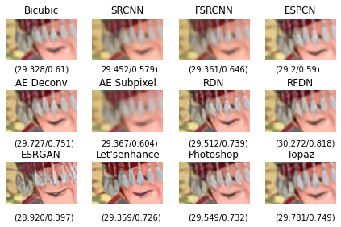
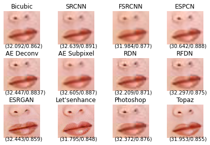
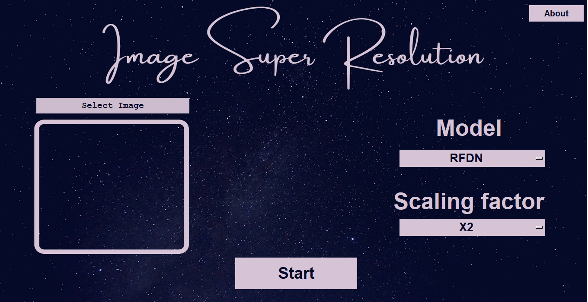
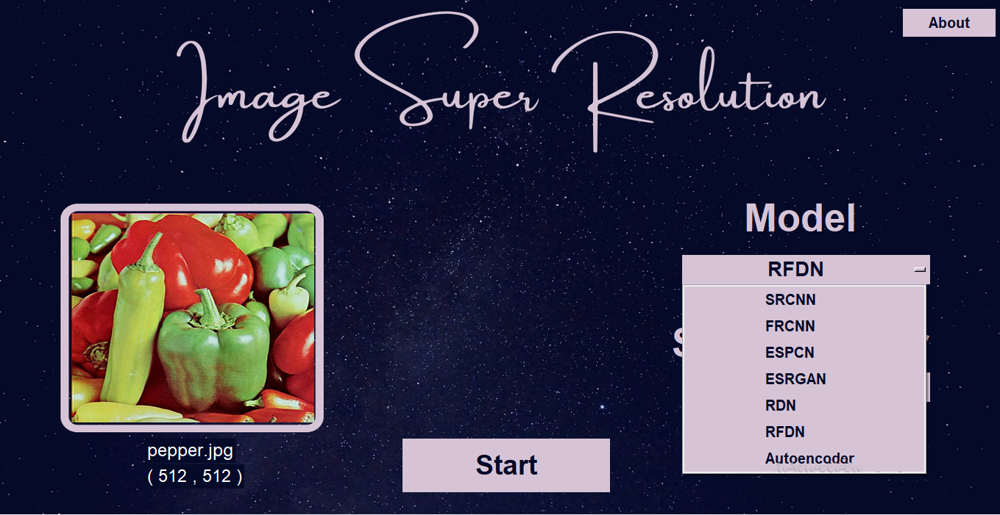
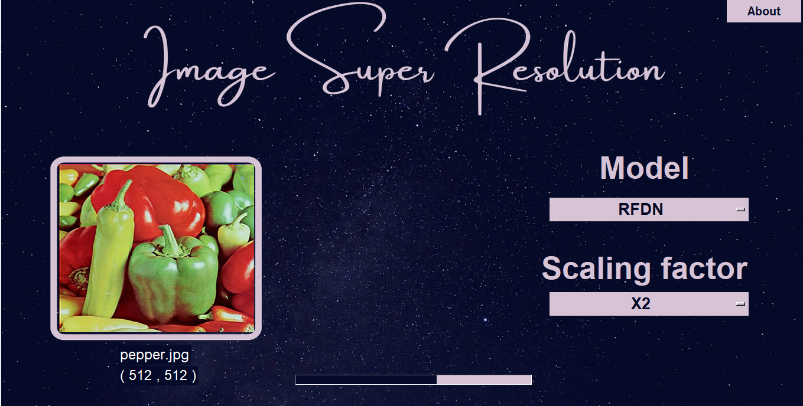
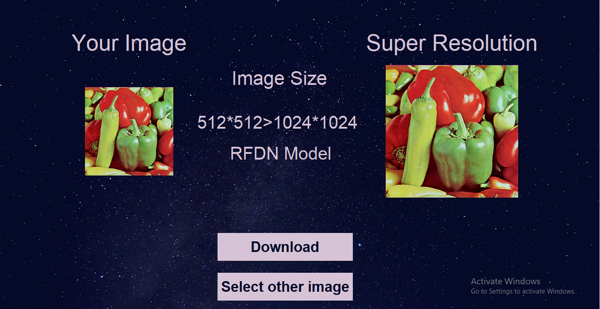
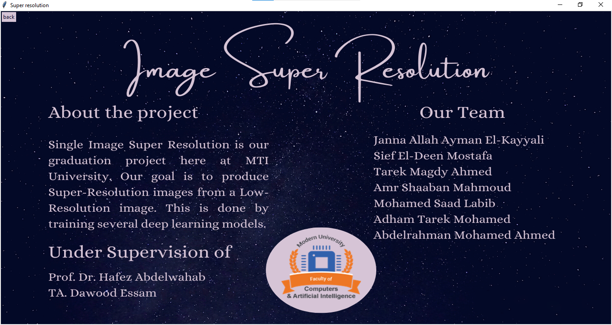

# Super resolution
We made a gui for the 7 implemented models.
you can download it from here: [GUI](https://drive.google.com/drive/u/0/folders/18Rl6BXplY3IWJL8EgoU8C97STKo7gvEv)

## Table of Contents  
* [Abstract](#abstract)  
* [Requirements](#requirements) 
* [Training](#training)
* [Testing](#testing)
* [Results](#results)
* [GUI](#gui)
.
## Abstract
Image super-resolution (ISR) is the process of recovering high-resolution (HR) images from low-resolution (LR) images. In the last two decades, significant progress has been made in the field of super resolution, especially by utilizing deep learning methods.  Seven models have been  implemented based on Convolutional Neural Networks (CNN) which are Image Super-Resolution Using Deep Convolutional Networks (SRCNN), Fast Super Resolution Convolutional Neural Network (FSRCNN), Residual Dense Network (RDN), Efficient Sub-Pixel Convolutional neural network (ESPCN), Residual Feature Distillation Network for Lightweight Image Super-Resolution (RFDN), and Deep Auto-encoder for Single Image Super-Resolution, Enhanced super resolution Generative Adversarial Network (ESRGAN). 

## Requirements
*	Python :3.8.8
*	Tensorflow :2.3.0
*	Keras :2.4.0
*	Open-Source Computer Vision Library (Cv2):4.0.1
*	matplotlib :3.3.4
*	skimage :0.18.1

## Training 
The seven implemented models have been trained on [DIV2K dataset](https://data.vision.ee.ethz.ch/cvl/DIV2K/), which contains **900 RGB images**  with different scenes and sizes with PNG extension.We have divided those 900 images to 80% for training and 20% for validation. The models have been trained in different scales (x2,x4). The models have been trained from 50 to 120 epochs, ADAM optimizer, MSE loss function, RELU activation function, and 10-3 learning rate. the models have been trained on **Saturn Cloud Server** having the following specifications: Size: **8 cores – 64 GB RAM, 40Gi Disk Space – CPU Hardware**.

## Testing
We have generated the testing LR images by down-sampling HR images with scaling factors (x2, x3, x4, or x8) using bicubic interpolation to be able to assess the images on an objective method (PSNR/SSIM). We used 4 testing datasets, two widely used benchmark datasets: **Set5, Set14, and a medical dataset, and our created datasets**. The low-resolution images have been used as inputs to the model, and the original resolution images from the datasets have been used as the ground-truth images.
### The test datasets ( Low and High resolution images with different scale )
[Set5 dataset](https://drive.google.com/drive/u/0/folders/1_A7Tp2PLx9FULiZRj9yDVfJnuo2cHJ-Z)

[Set14 dataset](https://drive.google.com/drive/u/0/folders/1XV7F4zpCHenQk99bBg0aTo8i0B2yDERT)

[Medical dataset](https://drive.google.com/drive/u/0/folders/1_aUXgZkGojVar6zvGgxe45rTCPrTsNeZ)

[our dataset](https://drive.google.com/drive/u/0/folders/12Woe0CqmZ5HbZTh4fiBTXTYZFSpsjeA3)

## Results 
The performance can be assessed in 3 factors objectively (PSNR and SSIM), subjectively and time of processing (time taken for each model to predict the super resolution image).

### Set5 Dataset Results Objectively:
    
| Models                        | Scale x2 (PSNR/ SSIM)  | Scale x4 (PSNR/ SSIM)|
| ------------------------------| -------------          | ---------------- |
| SRCNN                         | (32.63916/0.90650)     | (31.1635/0.6996) |
| FSRCNN                        | (32.58261/ 0.8710)     | (31.3444/0.7421) |
| ESPCN                         | (31.66237/ 0.8891)     | (31.3510/0.7090) |
| RDN                           | (33.7007/ 0.8983)      | (30.5153/0.7212) |
| RFDN                          | **(34.13620/ 0.9069)** | (31.3595/0.7626) |
| Autoencoder  (Deconvolution)  | **(34.45608/ 0.9142)** | (31.4657/0.7842) |
| Autoencoder  (Subpixel)       | (33.30608/ 0.8870)     | (31.7322/0.7734) |
| ESRGAN                        | Content Cell           | (32.0604/0.8103) |
| Adobe photoshop               | (32.63916/0.85887)     | ---------------- |
| Topaz                         | (32.39536/0.85871)     | (30.6606/0.6889) |
| Let's enhance                 | (31.43409/0.80774)     | ---------------- |

From the previous table, we have assumed that for scale 2 the best results are for **Autoencoder (Deconvolution)** with results (34.45608/ 0.9142) and **RFDN** with results (34.13620/ 0.9069), While the worst results for **Let’s enhance** are (31.43409/0.80774) and **ESPCN** with results (31.66237/ 0.8891). However, for scale 4 ESRGAN has the best results are (32.0604/0.8103).

### The subjective 
### comic image 

 
### woman image
 

From the previous Images, The most consistent model over all the tested datasets is the RFDN, and Let’s Enhance.

### The time of processing
The time by seconds taken for some images (from test datasets) to be converted to super resolution by time () function in python.

| Models                        | Baby (512, 512)   Scale x2| Bird (288, 288) Scale x2 | Baby (228, 344)   Scale x2 | 
| --------| ------------- | ---------- |----------------  |
| SRCNN                         | 0.96     | 0.31   |0.29 |
| FSRCNN                        | 0.31     | 0.19   |0.08 |
| ESPCN                         | 0.20     | 0.08   |0.09 |
| RDN                           | 82.01    |22.84   |22.02|
| RFDN                          | 1.76     |0.54    |0.49 |
| Autoencoder  (Deconvolution)  | 0.97     | 0.57   |0.32 |
| Autoencoder  (Subpixel)       | 1.19     | 0.58   |0.38 |

From the previous table, we can conclude that **FSRCNN and ESPCN** are the **fastest models**.While **RDN and ESRGAN** are the **slowest models**.

## GUI 

We have used Tkinter library to create our application, Tkinter library is a cross-platform GUI framework that comes built into the Python standard.Our application consists of three pages: 
First Page:
The first page consists of  3 buttons, 2 dropdown menus, display image, loading bar as shown in figure below.

  

Second Page:
The second page show displays which are Input Image (Low Resolution Image), Output Image (Super resolution Image), Image size (before and after scaling), The chosen modelwith 2 buttons as shown in figure below.

Third Page:
The third page is the About Page, it displays the team members, supervisors, and a summary of the project as shown in figure below.

